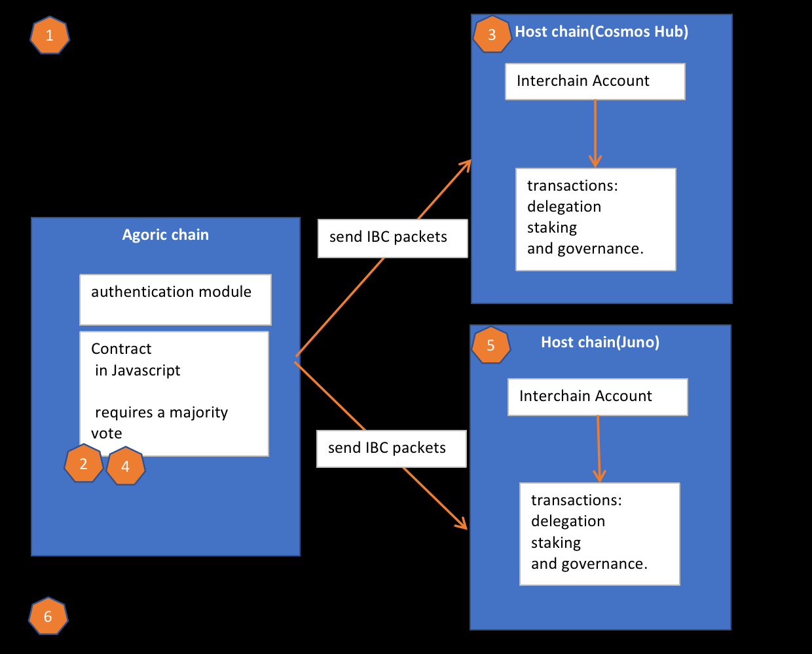

# [JS Contract Controls Cosmos Hub ICA Bounty] Plan

We analyzed the requirements of the task (<a href="https://gitcoin.co/issue/28955">JS Contract Controls Cosmos Hub ICA Bounty</a>) and are very interested in the project. 

Our plan is as follows:

## Plan

| NO | Content  | Time Estimation |
|-----|------|------|
| 1 | Establish a test environment |3 days |
| 2 | Provide governance authority to a group of 3 or more individuals |4 days|
| 3 | Control an Interchain Account on the Cosmos Hub |2 days|
| 4 | Allow contract governance to decide on delegation/re-delegation/unbonding, claim staking rewards, and vote on Cosmos Hub governance actions|6 days|
| 5 | Make the choice of external chain configurable by governance|2 days|
| 6 | Document open source code and walkthrough presentation |4 days|

## Contact

Discord : https://discord.com/users/883875037365538816 (better contact) 
> user name:uptSmart#7069 
> 
Telegram : https://t.me/uptSmart   
Email : [xuxinlai2002@gmail.com](mailto:xuxinlai2002@gmail.com)  

Thank you

